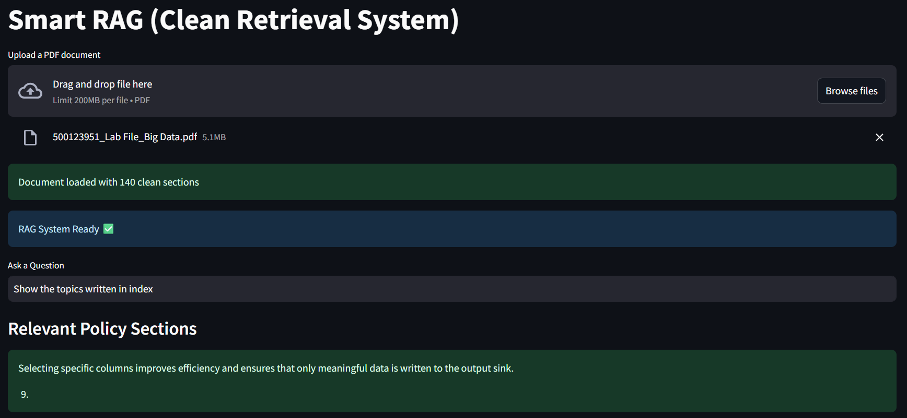

# 📄 Smart RAG System

A PDF-based question-answering and information retrieval system built using **Python, Streamlit, TF-IDF, and FAISS**.

The application allows users to upload a PDF document and ask natural-language questions. It processes the document, converts text sections into numerical vectors, and retrieves the most relevant sections for the user's query.

---

## 🚀 Live Demo

👉 [Try the Smart RAG System](https://bhavishya-smart-rag.streamlit.app)

## 🖥️ Application Preview



---

## 🚀 Features

- 📤 Upload PDF documents through a Streamlit interface
- 📄 Extract text automatically from PDF files
- ✂️ Split extracted text into meaningful sections
- 🔢 Convert document sections into vectors using TF-IDF
- 🔍 Perform fast similarity search using FAISS
- 💬 Ask natural-language questions about the uploaded document
- 🎯 Retrieve the top 3 most relevant sections
- 🖥️ Simple interactive web interface built with Streamlit

---

## 🛠️ Tech Stack

| Technology | Purpose |
|---|---|
| Python | Core application development |
| Streamlit | Interactive web interface |
| PyPDF | PDF text extraction |
| Scikit-learn | TF-IDF vectorization |
| FAISS | Similarity search |
| NumPy | Numerical data processing |

---

## ⚙️ How It Works

```text
PDF Upload
    ↓
Text Extraction
    ↓
Text Chunking
    ↓
TF-IDF Vectorization
    ↓
FAISS Index
    ↓
User Question
    ↓
Query Vectorization
    ↓
Similarity Search
    ↓
Top Relevant Sections
```

1. The user uploads a PDF document.
2. Text is extracted from every page using **PyPDF**.
3. The extracted text is divided into meaningful sections.
4. **TF-IDF** converts each section into a numerical vector.
5. The vectors are stored in a **FAISS** index.
6. The user's question is converted using the same TF-IDF vectorizer.
7. FAISS searches for the **3 closest document sections**.
8. The most relevant information is displayed to the user.

---

## 📂 Project Structure

```text
Smart-RAG-System/
│
├── app.py
├── requirements.txt
└── README.md
```

### `app.py`

Contains the main application including:

- PDF processing
- Text chunking
- TF-IDF vectorization
- FAISS indexing
- Similarity search
- Streamlit user interface

### `requirements.txt`

Contains the Python dependencies required to run the application.

---

## 💻 Installation

### 1. Clone the repository

```bash
git clone https://github.com/Bhavishya289/Smart-RAG-System.git
```

### 2. Move into the project directory

```bash
cd Smart-RAG-System
```

### 3. Install dependencies

```bash
pip install -r requirements.txt
```

### 4. Run the application

```bash
streamlit run app.py
```

The Streamlit application will open in your browser.

---

## 📖 Usage

1. Upload a text-based PDF document.
2. Wait for the application to process and index the document.
3. Enter a question related to the uploaded PDF.
4. The system searches the document using FAISS.
5. The most relevant sections are displayed as the result.

---

## 🔮 Future Improvements

- Integrate an LLM for generated answers based on retrieved context
- Add support for multiple PDF documents
- Improve semantic retrieval using embedding models
- Add conversational question history
- Support additional document formats
- Deploy the application online

---

## 👨‍💻 Author

**Bhavishya Singh Masand**

B.Tech CSE (Hons.) in Big Data  
UPES, Dehradun

[LinkedIn](https://www.linkedin.com/in/bhavishya-singh-masand-2874b022b)
